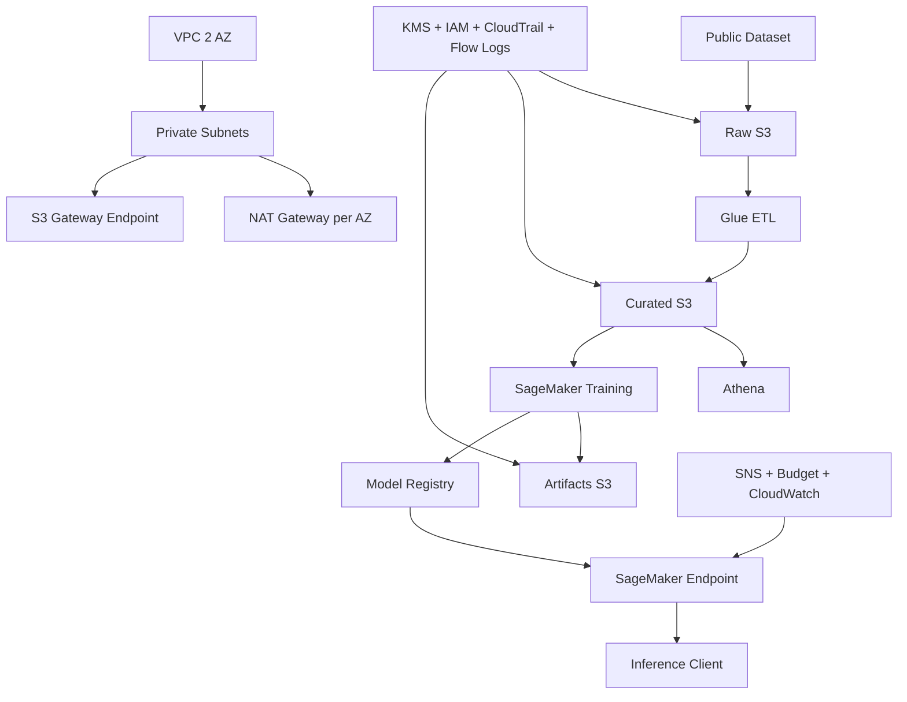

# Architecture

## Boundaries

Infrastructure owns shared AWS foundation and security controls. Data Collection owns ingestion, ETL, catalog/query and validation. MLOps owns SageMaker training, model lifecycle, deployment and inference.

The key data dependency is `Raw S3 -> Glue -> Curated S3 -> MLOps`; MLOps does not ingest a second copy of the source dataset.
