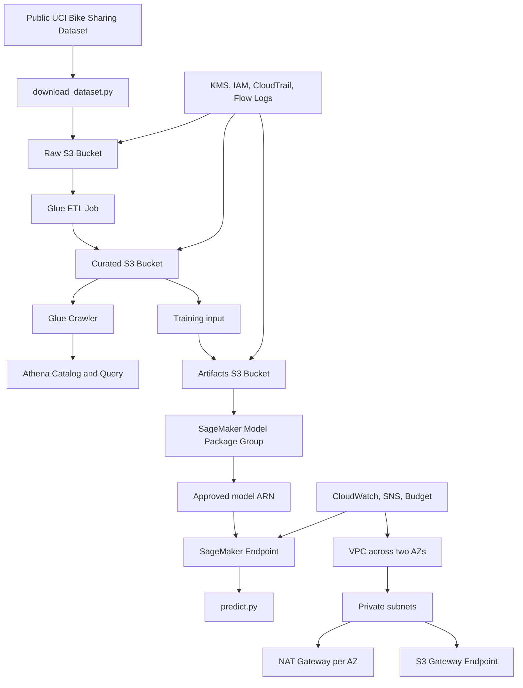

# BMW AWS ML Platform Implementation Guide

## 1. Purpose

This repository implements a small end-to-end AWS data and machine-learning platform:

1. A public Bike Sharing dataset is downloaded and placed in the raw S3 zone.
2. AWS Glue transforms the raw data into a curated S3 zone.
3. AWS Glue Crawlers and Athena make the curated data queryable.
4. SageMaker configuration provides model registry and approved-model endpoint integration.
5. Python utilities train, evaluate and invoke a model when the required curated data and model artifacts are available.

The design is intentionally split into reusable Terraform modules so another environment can use the same infrastructure with different variables.

## 2. Repository Structure

```text
terraform/
  environments/prod/       Root environment and provider/backend configuration
  modules/
    infrastructure/        Shared AWS foundation and security
    data-collection/       Ingestion, Glue, Athena and validation
    mlops/                 SageMaker, registry, endpoint and inference resources
data/
  ingestion/               Dataset download and preparation
  transformation/          Glue transformation script
  validation/              Data-quality validator and invalid fixture
ml/
  training/                Model training script
  evaluation/              Evaluation script
  inference/               SageMaker endpoint client
docs/
  architecture.md          Mermaid architecture diagram
  assessment-checklist.md  Assignment checklist
  implementation-guide.md  This document
.github/workflows/
  terraform-plan.yml       Format, validate, plan and merge apply
  security-scan.yml        Checkov security scan
```

## 3. Architecture and Data Flow



The important cross-task dependency is:

`Raw S3 -> Glue -> Curated S3 -> ML training`

The ML layer is designed to consume the curated output, not a second copy of the original dataset.

## 4. Terraform Design

The root environment in `terraform/environments/prod` composes three top-level modules:

```hcl
module "infrastructure" {
  source = "../../modules/infrastructure"
}

module "data_collection" {
  source = "../../modules/data-collection"
}

module "mlops" {
  source = "../../modules/mlops"
}
```

The environment passes shared values between modules:

- `name_prefix`: generated from `environment` and `project`
- `region`: AWS deployment Region
- `vpc_cidr`: network address range
- S3 bucket names from infrastructure to data and MLOps
- IAM role ARNs from infrastructure to Glue and SageMaker
- KMS key ARN to storage and workload integrations
- common tags to all modules
- feature flags for budgets, alerts and training

Each child module has its own `variables.tf`, `main.tf` and `outputs.tf`. Resources are addressed through variables and outputs rather than fixed account IDs, ARNs or bucket names.

### Remote state

The S3 backend is intentionally configured at initialization time. The repository contains the backend block, but the actual state bucket is supplied by the operator or CI:

```bash
cd terraform/environments/prod
terraform init \
  -backend-config="bucket=<STATE_BUCKET>" \
  -backend-config="key=bmw/prod/terraform.tfstate" \
  -backend-config="region=<AWS_REGION>" \
  -backend-config="encrypt=true" \
  -backend-config="use_lockfile=true"
```

This keeps account-specific backend details out of reusable source and prevents Terraform state from being committed to Git.

### Naming and tags

Resource names use `${environment}-${project}` as a prefix. The AWS provider applies `default_tags` from the root environment:

- `Owner`
- `Project`
- `Team`
- `Environment`
- `CostCenter`

Individual resources add a `Name` tag and, where useful, a `Tier` tag such as `public` or `private`.

## 5. AWS Services and Configuration

### Amazon VPC

The VPC module creates:

- One VPC using the configurable `vpc_cidr` value
- Two public subnets in the first two available Availability Zones
- Two private subnets in the same Availability Zones
- One Internet Gateway
- One Elastic IP and NAT Gateway per Availability Zone
- Separate public and private route tables
- Public default routes through the Internet Gateway
- Private default routes through the NAT Gateway in the same AZ
- An S3 Gateway VPC Endpoint attached to private route tables
- DNS support and DNS hostnames enabled

The default CIDR is `10.0.0.0/16`. Public and private subnet CIDRs are calculated with `cidrsubnet`, leaving separate ranges per AZ and enough address space for this small platform.

The second NAT Gateway keeps the second private subnet's outbound path independent if one Availability Zone fails. NAT gateways have AWS hourly and data-processing charges, so the design trades cost for availability.

### Amazon S3

The S3 module creates three separate buckets with generated suffixes:

| Zone | Purpose | Lifecycle expiration |
|---|---|---:|
| Raw | Original downloaded input | 30 days |
| Curated | Glue output used by Athena and ML | 90 days |
| Artifacts | Glue scripts, Athena results and ML artifacts | 180 days |

Each bucket has:

- Versioning enabled
- AWS KMS server-side encryption
- S3 Bucket Key enabled
- Block Public Access enabled
- `force_destroy = true` for this demonstration environment

CloudTrail also creates a dedicated audit bucket. It has versioning, AES256 encryption, Block Public Access, and a three-day lifecycle for current and noncurrent objects.

### AWS KMS

A customer-managed KMS key is created with:

- Automatic key rotation enabled
- Seven-day deletion window
- Alias based on the environment name
- Key ARN passed to S3 and workload modules

The data and ML workload policies are scoped to this key for encryption and decryption operations.

### IAM

Separate service roles are created:

- Data role trusted by `glue.amazonaws.com`
- ML role trusted by `sagemaker.amazonaws.com`
- VPC Flow Logs role trusted by `vpc-flow-logs.amazonaws.com`
- Optional evaluator role trusted by the configured evaluator account and external ID

The data role can access raw and curated S3 zones, use the KMS key, and call the Glue operations required by the pipeline. It cannot access the artifacts bucket or SageMaker operations.

The ML role can read curated data, write artifacts, use the KMS key, and describe/list/invoke SageMaker resources. It cannot access the raw bucket or Glue administration operations.

The policies use resource ARNs for S3 and KMS. Some Glue and SageMaker APIs require `*` resource scope in AWS IAM; the action lists are limited to the operations needed by the platform. Administrator access is not used.

### AWS CloudTrail

CloudTrail is configured as a multi-Region trail with global service events and log-file validation enabled. Logs are written to the dedicated audit S3 bucket through a bucket policy that permits only the required CloudTrail bucket ACL and log-write operations.

### VPC Flow Logs and CloudWatch Logs

VPC Flow Logs capture `ALL` traffic and deliver it to a CloudWatch log group:

- Log group: `/<name-prefix>/vpc-flowlogs`
- Retention: 3 days
- Dedicated delivery role with only log delivery permissions

The inference log group is also configured with three-day retention.

### CloudWatch

The CloudWatch module creates:

- A dashboard for NAT Gateway `BytesOutToDestination`
- One NAT byte alarm per NAT Gateway
- Five-minute metric period
- Threshold of 100,000,000 bytes
- Missing data treated as not breaching
- Optional SNS alarm action

NAT gateway IDs are converted into index-keyed maps for Terraform `for_each`, so resource keys remain known during planning.

### Amazon SNS and AWS Budgets

SNS creates an alerts topic and an optional email subscription when `alert_email` is non-empty.

The optional monthly AWS Budget uses:

- Monthly cost budget
- Default limit of USD 50
- Actual-cost notification at 80 percent
- SNS notification when alerting is enabled

### AWS Glue

The data-collection module creates:

- An S3 object containing `glue_transform.py`
- A Glue Data Catalog database
- A Glue ETL job using Glue 4.0 and two `G.1X` workers
- A curated-data Glue crawler

The job receives raw and curated S3 paths through default arguments. The crawler targets the curated `bike-sharing/` prefix.

### Amazon Athena

Athena creates:

- A workgroup with enforced configuration
- Query output under `s3://<artifacts-bucket>/athena-results/`
- A named sample query against the curated table

### Amazon SageMaker

The MLOps modules create:

- A SageMaker model package group
- Conditional model, endpoint configuration and endpoint resources
- An inference CloudWatch log group

Endpoint resources are created only when `approved_model_package_arn` is supplied. This prevents an unapproved or nonexistent model from being deployed.

The Terraform training module exposes an optional SageMaker Pipeline resource because the selected provider configuration does not support a direct training-job resource. The pipeline is disabled by default and requires a compatible training image URI. Once enabled, it submits the training step against the curated S3 path and writes output to the artifacts bucket. Training execution, model registration, approval and endpoint deployment remain runtime steps.

## 6. Python Code

### Ingestion

`data/ingestion/download_dataset.py` downloads the public UCI Bike Sharing dataset, validates the archive contents, prepares a CSV, and writes it to the ingestion output directory.

### Transformation

`data/transformation/glue_transform.py` is uploaded to the artifacts bucket and executed by Glue. It receives input and output locations through Glue job arguments.

### Validation

`data/validation/quality_check.py` checks required columns and invalid target values. `data/validation/invalid_dataset.csv` demonstrates a failing data-quality case.

### Training

`ml/training/train.py` validates the training directory and required feature columns, trains an XGBoost regression model, and saves the model artifact.

### Evaluation

`ml/evaluation/evaluate.py` validates actual and predicted numeric values, calculates mean absolute error, and emits JSON results.

### Inference

`ml/inference/predict.py` accepts an endpoint name and prediction payload, invokes the SageMaker endpoint with boto3, and prints the response.

## 7. CI and Security Workflows

### Terraform workflow

`.github/workflows/terraform-plan.yml` runs on pull requests and pushes to `main`.

For pull requests and the plan stage it runs:

- `terraform fmt -check -recursive`
- `terraform init -backend=false`
- `terraform validate`
- `terraform plan`

The apply stage runs only after a successful push to `main`, uses the protected `production` environment, initializes the S3 backend, and runs `terraform apply -auto-approve`.

The workflow uses GitHub OIDC. Repository or environment configuration must provide:

- Variable `AWS_REGION`
- Secret `AWS_ROLE_TO_ASSUME`
- Secret `TF_STATE_BUCKET`
- An AWS IAM trust policy allowing the GitHub repository's OIDC subject

### Security scan

`.github/workflows/security-scan.yml` runs Checkov for Terraform on pull requests and pushes to `main`. It produces CLI and JSON output, fails on findings, and uploads `checkov-results.json` as a workflow artifact.

A successful CI run should be retained with the submission. Findings must be reviewed and either fixed or documented with a justification in this repository.

## 8. Deployment

Prerequisites:

- Terraform 1.5 or later
- AWS credentials or GitHub OIDC
- An AWS account and target Region
- An S3 bucket for Terraform state
- Permission to create the listed resources
- Evaluator account ID and external ID, if evaluator access is required

Example commands:

```bash
cd terraform/environments/prod
cp terraform.tfvars.example terraform.tfvars
# Edit terraform.tfvars with the target Region and approved values.
terraform init \
  -backend-config="bucket=<STATE_BUCKET>" \
  -backend-config="key=bmw/prod/terraform.tfstate" \
  -backend-config="region=<AWS_REGION>" \
  -backend-config="encrypt=true" \
  -backend-config="use_lockfile=true"
terraform fmt -recursive ../..
terraform validate
terraform plan -var="region=<AWS_REGION>"
terraform apply -var="region=<AWS_REGION>"
```

Review the plan before applying. Confirm the SNS email subscription if an email address is configured.

## 9. Destroy

```bash
cd terraform/environments/prod
terraform destroy -var="region=<AWS_REGION>"
```

The demonstration S3 buckets use `force_destroy` so Terraform can remove their contents. A production design should use retention and recovery controls instead. Confirm the destroy operation in AWS and verify that no resources remain. The repository should record the date and account/Region used for that verification before submission.

## 10. Estimated Cost and Assumptions

The smallest meaningful cost drivers are the NAT gateways, CloudTrail storage, Glue worker runtime, CloudWatch logs, Athena queries, KMS requests, and any SageMaker runtime or training time. Two NAT gateways are intentionally retained for Availability Zone resilience, even though they are not free-tier resources.

For a short demonstration with no sustained SageMaker endpoint, low-volume logs, small S3 objects, and only occasional Glue/Athena use, estimate approximately USD 70-100 per month, subject to Region pricing and usage. A continuously running SageMaker endpoint and repeated training jobs can increase this substantially. The configured USD 50 budget is an alert threshold, not a guaranteed maximum.

## 11. Current Verification Status

Verified locally:

- Terraform formatted with `terraform fmt`
- Terraform initialization completed without the backend
- `terraform validate` passed
- AWS credentials were used successfully for a real plan
- Terraform plan reported `No changes`
- Python files compiled successfully
- The invalid data fixture produces an intentional validation failure

The following require execution evidence in the target account or GitHub repository:

- Successful clean-state apply and destroy
- Dataset upload and Glue job run
- Glue crawler and Athena query
- Training and model approval
- Endpoint prediction
- Successful Checkov result with triage
- Evaluator role assumption and read-only inspection

## 12. What I Would Do With More Time

1. Supply and validate a versioned Parquet-capable training image for the Terraform-managed SageMaker Pipeline.
2. Add a focused automated unit test for transformation and validation behavior.
3. Add a custom least-privilege evaluator policy that allows configuration inspection while explicitly denying data reads and mutation.
4. Add interface VPC endpoints for any privately called AWS APIs beyond S3.
5. Add CI plan artifact publishing, apply approval gates, and drift detection.
6. Run Checkov, commit the output and document each accepted finding.
7. Replace demonstration `force_destroy` and short log retention with production retention policies.

## 13. Assessment Checklists

### Infrastructure as Code

- [x] Terraform version requirement is declared as `>= 1.5.0`.
- [x] AWS and Random provider versions are pinned with compatible constraints.
- [x] S3 remote backend block is present and configured through `terraform init` arguments.
- [x] Infrastructure is split into reusable modules with variables and outputs.
- [x] No hardcoded account IDs, ARNs or generated bucket names are used in reusable modules.
- [x] `terraform fmt` has been run.
- [x] `terraform validate` passes.
- [x] A real plan was completed and reported `No changes`.
- [ ] Clean-state apply and destroy have been recorded as submission evidence.

### Foundation and Security

- [x] VPC spans two Availability Zones.
- [x] Public and private subnets are present.
- [x] Internet Gateway and one NAT Gateway per AZ are configured.
- [x] Private route tables use their same-AZ NAT Gateway.
- [x] S3 Gateway VPC Endpoint is attached to private route tables.
- [x] Raw, curated and artifacts S3 zones are separate buckets.
- [x] S3 versioning, KMS encryption, lifecycle rules and Block Public Access are configured.
- [x] Customer-managed KMS key has rotation enabled.
- [x] Separate Glue/data and SageMaker/ML execution roles exist.
- [x] CloudTrail is multi-Region with log-file validation enabled.
- [x] VPC Flow Logs are enabled.
- [x] CloudTrail and Flow Logs have deliberate retention settings.
- [x] Default tags include Owner, Project, Environment and CostCenter.
- [x] Budget, SNS and CloudWatch controls are configured.
- [ ] Checkov output has been committed and every accepted finding has been triaged.

### Data Pipeline

- [x] Public dataset choice is documented.
- [x] Ingestion code downloads and validates the dataset.
- [x] Raw S3 is the source zone.
- [x] Glue ETL receives raw and curated S3 paths through job arguments.
- [x] Curated S3 is the output zone.
- [x] Glue Catalog database and crawler are configured.
- [x] Athena workgroup and sample query are configured.
- [x] Data-quality validation code exists.
- [x] An intentionally invalid fixture demonstrates a failing validation run.
- [ ] Dataset upload, Glue execution, crawler completion and Athena query results are recorded.

### ML Pipeline

- [x] ML module receives the curated bucket from the data layer.
- [x] Training script validates input columns and writes a model artifact.
- [x] Evaluation script validates values and calculates mean absolute error.
- [x] Inference client invokes a SageMaker endpoint through boto3.
- [x] SageMaker model package group is created.
- [x] Endpoint creation is gated on an approved model package ARN.
- [ ] A provider-supported SageMaker training job is provisioned and executed.
- [ ] A model package is approved and an endpoint is deployed.
- [ ] A successful endpoint prediction is recorded.

### IAM and Evaluator Access

- [x] Workload roles use service-specific trust policies.
- [x] Data role is scoped to raw and curated data operations.
- [x] ML role is scoped to curated and artifacts operations.
- [x] No AdministratorAccess policy is attached to workload roles.
- [x] Evaluator access requires an evaluator account ID and external ID.
- [x] Evaluator role is optional and is removed when its inputs are empty.
- [ ] Evaluator role ARN and deployment Region are sent to the evaluator.
- [ ] Evaluator assumes the role successfully and confirms read-only access.

### Automation and Repository Hygiene

- [x] Pull requests run Terraform formatting, initialization and validation.
- [x] Pull requests run Terraform plan.
- [x] Pull requests run Checkov.
- [x] Pushes to `main` run the Terraform apply stage after the plan stage.
- [x] CI uses GitHub OIDC rather than committed AWS credentials.
- [x] Checkov results are uploaded as a workflow artifact.
- [x] `.gitignore` excludes tfvars, state files, `.terraform/` and local credentials.
- [x] Meaningful commits exist in the repository history.
- [ ] GitHub repository variables, secrets and OIDC trust policy are configured.
- [ ] A successful CI run and security report are retained for submission.
- [ ] Repository read access is granted to the evaluator accounts.
- [ ] Submission email includes the repository URL and evaluation commit SHA.

### Documentation Handoff

- [x] Architecture diagram covers foundation, data and ML layers.
- [x] Deployment steps are documented.
- [x] Destroy steps are documented.
- [x] Assumptions and estimated costs are documented.
- [x] Known limitations are documented.
- [x] Future improvements are documented.
- [ ] Destroy verification date, AWS Region and result are added.
- [ ] Runtime execution evidence and security scan triage are added.
